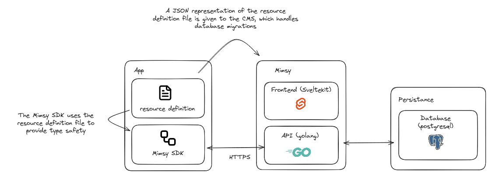

# Architecture description

This document describes the high level architecture components used to build the mimsy CMS.

## Summary

Mimsy is a headless CMS that can be used through its SDK. Mimsy uses resource definitions managed by the user to define the collections and their structure. The system is inspired by [Payload CMS](https://payloadcms.com), allowing developers to define collections, their shape, fields, and types in TypeScript files that are then processed to create schema definitions for different versions.

## Why Build Another CMS?

The decision to create mimsy stems from limitations encountered with existing CMS solutions in our development workflow and deployment practices.

### Issues with Existing Solutions

#### Payload CMS
We used [Payload CMS](https://payloadcms.com) extensively, but found it moving toward excessive customizability with hooks and custom elements. This high degree of customization creates a substantial initial cost for system setup. With the advent of LLMs, it's often easier to build a system from scratch than to navigate Payload's complex customization layer.

#### PocketBase
[PocketBase](https://pocketbase.io) presented migration challenges that conflicted with our Kubernetes deployment methodology. Our practice of running both old and new versions simultaneously for validation creates either a split-brain situation for client data or forces all-or-nothing deployments with potential downtime on failure.

#### Strapi
[Strapi](https://strapi.io) is widely adopted in agencies, but suffers from a blurred source of truth. Changes can be made through either the admin UI or code-first approaches, requiring frequent code synchronization. This creates a poor developer experience and potential inconsistencies.

#### WordPress
[WordPress](https://wordpress.org) has similar source-of-truth issues, compounded by PHP's complexity for modifications. We prefer to minimize the number of languages in our technology stack.

### Our Requirements

- **SvelteKit Integration**: As a Svelte/SvelteKit-focused team, we need first-class integration with our daily ecosystem
- **Code as Source of Truth**: All schema changes must happen in code, eliminating UI-based modifications
- **Zero Downtime Deployments**: Support for our Kubernetes deployment patterns with live migrations
- **Simplicity**: Lower initial setup costs compared to highly customizable solutions
- **Ownership**: Control over our processes to enable innovation and maintain our development practices
- **Type Safety**: TypeScript-first approach for compile-time validation

Mimsy addresses these requirements by providing a streamlined, code-first CMS that integrates seamlessly with our existing development and deployment practices.

## Technologies

### Admin Panel

**SvelteKit**

The admin panel is built using SvelteKit and provides a web-based interface for content management. It dynamically consumes the resource definitions to generate appropriate forms and interfaces for creating, editing, and deleting resources within collections. **Schema modifications are not possible through the admin UI - code remains the source of truth.**

### Backend API

**Go**

Go was chosen as the backend language for its simplicity in building networked applications. The Go backend is truly dynamic, exposing a REST API that adapts based on the service configuration (resource definitions). It handles authentication, serves the admin panel, and provides the API endpoints for both the admin UI and external consumers.

### Database & Migrations

**PostgreSQL with pgroll**

PostgreSQL enables Mimsy to perform zero downtime migrations using [pgroll](https://pgroll.com/). The system uses pgroll to handle live migrations where both old and new schema versions remain accessible simultaneously, identified by commit hash. This allows for seamless schema evolution without service interruption.

### Resource Definition CLI

**Go CLI (or JavaScript)**

A small CLI tool processes the TypeScript resource definitions and collects them to create schema definitions for each version and their modifications. The CLI stores migration decisions in a `.mimsy` folder, tracking choices like whether a collection change represents a rename or a new column. This metadata guides the backend and migration system on how to handle live migrations properly.

### SDK & Resource Definitions

**TypeScript**

The SDK allows developers to define their collections and blocks in TypeScript files. These definitions specify the shape, fields, and types of each collection. The SDK is designed to be type-safe, leveraging TypeScript's type system to ensure resources are correctly defined and used.

The **Resource Definition Format** is standardized to enable interoperability, allowing tooling in other languages to work with the same resource definitions.

## Core Workflow

### Resource Definition Processing

Resource definitions are processed through the following workflow:
1. Developers define collections in TypeScript files
2. The CLI tool discovers and processes these definitions
3. Schema definitions are generated for each version
4. Migration decisions are stored in the `.mimsy` folder
5. The Go backend dynamically configures its REST API based on these definitions
6. The admin panel consumes the definitions to generate appropriate interfaces

### Schema Evolution & Live Migrations

When schema changes occur:
1. The CLI detects changes in resource definitions
2. It prompts developers to clarify ambiguous changes (e.g., "Is this field renamed or is it a new field?")
3. These decisions are stored in the `.mimsy` folder for future reference
4. pgroll creates a live migration where both old and new schema versions coexist
5. The system uses commit hashes to identify which schema version to use for queries
6. Zero downtime is maintained throughout the migration process

## Key Benefits

- **Type Safety**: TypeScript-based resource definitions ensure compile-time validation
- **Zero Downtime**: pgroll enables live migrations without service interruption
- **Code as Source of Truth**: All schema changes happen in code, not through UI
- **Interoperability**: Standardized resource definition format enables multi-language tooling
- **Dynamic API**: Backend automatically adapts to schema changes
- **Version Control**: Git commits track schema versions for precise querying
