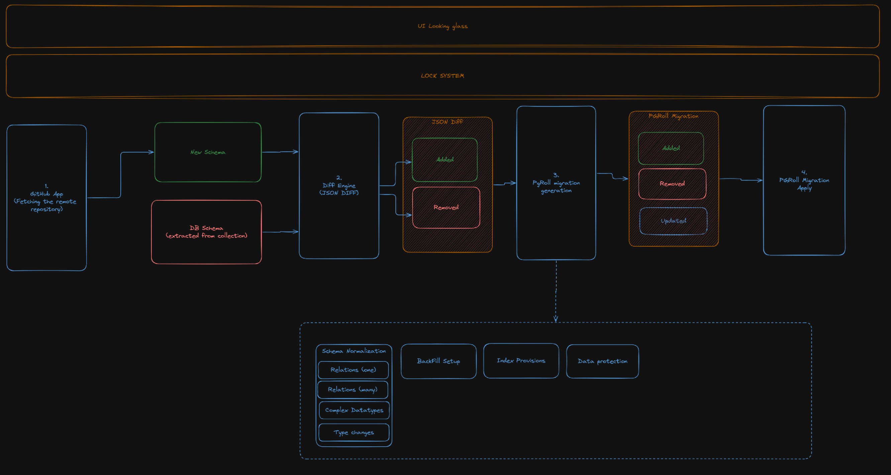

# Collections Migrations

Collection migrations is the heart of the CMS. It allows you to define the structure of your collections and manage their data, as you are evolving your website.

Our objective is to make it as simple as possible for the user, and make issues as recoverable as possible.

While we cannot guarantee that all migrations will work every time, we strive to make sure that the system can recover itself once the issue is fixed in an upgrade, or if a transient issue occurs.

## Design



## Components

### Lock system

To avoid situations where two instances if mimsy fights over each other, we use a distributed lock system. This system ensures that only one instance can perform a migration at a time, preventing data corruption and inconsistencies.

pgroll exposes the `State.IsActiveMigrationPeriod(ctx context.Context, schema string) bool` method, which allows us to check if a migration is currently in progress.

We can move the lock further down the migration process by naming the migrations after the commit hash. This way, we can skip any migration that has already been applied, and only apply the one that need to be applied (at this stage, we need the pgroll locking mechanism).

### Github API Repo fetching

Using the Github API, we can fetch the contents of the repository (See [Download a Repository Archive (zip)](https://docs.github.com/en/rest/repos/contents?apiVersion=2022-11-28#download-a-repository-archive-zip)), and then use that to fetch all the schema migrations inside of the .mimsy/schemas folder, and get the last one.

if the migration has changed, we can store inside of the database the new info, and then go to the next component

### Diff Engine

With the new schema and the current one (that should be stored inside of the database at all times), we can compare the two and generate a diff that can be applied to the database.

That generated diff only contains the JSON changes (additions or removals). The schema is not defined yet, but it is expected to be documented here once it is finalized.

The results of this operation are also stored inside of the database, so in the event of an error in the next step, we can re-execute it with all dependencies around.

### PgRoll Migration Generation

The objective of this step is to take the JSON diff of the schema, and generate the migrations required to apply the changes wanted to the database.

As always, once the migration is marked as finished, we can store the results inside of the database, so in the event of an error in the next step, we can re-execute it with all dependencies around.

This step is more complex, and should hold the following constraints:

#### 1. Normalize the schema

Take for example this easy schema:

```ts
const Tags = collection("tags", {
  name: string(),
});
const Post = collection("posts", {
  title: string(),
  tags: multiRelation(Tags),
});
```

It needs to create a new table called `relation__posts_tags` that will join the `posts` and `tags` tables inside of the database.

It should also convert a single relation into a many-to-one relation (with a column & a foreign key inside of the table of the collection that defines the relation)

#### 2. Handle the backfill

Depending on the setup, we might need to backfill the data inside of a newly created column (for example, an empty json entry for `richtext` fields)

#### 3. Provision the indexes

Indexes are required for performance reasons. We need to index the required columns in order to reach a correct performance.

The conditions are not yet defined, but in the event that we find a system, it will be defined here.

#### 4. Data Protection

To avoid data loss, we need to ensure that the pgroll migration doesn't loose data (at least until the migration is marked as finished)

No system is currently planned to handle this, but we need to ensure that the migration process is safe and reliable.

### PgRoll Migration Apply

This is the point where we call pgroll to apply the migration, that is going to create the new view, setup the triggers, and mark the migration as ready.

It should also handle the backfill, and execute it on the side.

### UI Looking Glass

We want users to be involved in the loop, and allow them to understand what is happening in the background.

Having a clear UI showing the synchronization status, and the current state of the migration process, will help users understand what is happening and how to resolve any issues that may arise.
